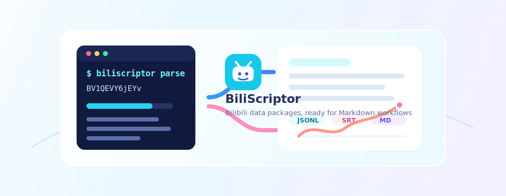
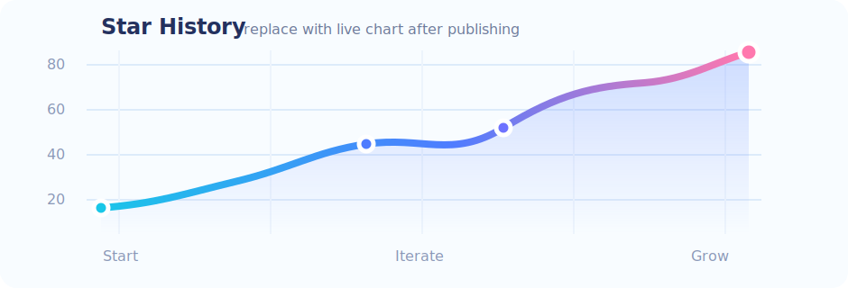

<p align="center">
  
</p>

<h1 align="center">BiliScriptor（哔稿匠）</h1>

<p align="center">
  一个本地优先的 B 站视频解析 CLI，把视频链接或 BV 号导出为可追溯、可阅读、可二次处理的数据包。
</p>

<p align="center">
  <a href="https://www.python.org/downloads/"></a>
  <a href="pyproject.toml"></a>
  <a href="tests/"></a>
  
</p>

<p align="center">
  
</p>

<p align="center">
  <code>Bilibili</code> · <code>CLI</code> · <code>Markdown Report</code> · <code>JSONL</code> · <code>SRT</code> · <code>Danmaku</code> · <code>Comments</code> · <code>Local First</code>
</p>

BiliScriptor 面向需要整理视频资料、归档评论弹幕、生成 Markdown 阅读报告的场景。它不会默认下载音视频文件，而是优先保存元数据、分 P、字幕、当前弹幕、评论、播放流候选和阶段 manifest，方便后续接入 ASR、OCR、抽帧或 LLM 分析流程。

## 功能亮点

- 解析 B 站视频链接或 BV 号，生成结构化本地数据包
- 支持扫码登录并保存本地 Cookie
- 导出字幕为 `.jsonl` 和 `.srt`
- 抓取当前弹幕、评论树、播放流候选信息
- 自动生成适合阅读和引用的 `report.md`
- 在 `manifest.json` 中记录每个阶段的状态和失败原因
- 默认隐藏 Cookie 敏感值，避免写入日志、报告或 manifest

## 安装

要求 Python 3.10 或更高版本。

```bash
python -m venv .venv
python -m pip install -e .
```

安装后可使用包入口：

```bash
python -m biliscriptor --help
```

也可以使用命令行工具：

```bash
biliscriptor --help
```

## 快速开始

```bash
# 1. 扫码登录，保存本地 Cookie
python -m biliscriptor login

# 2. 解析视频并生成数据包
python -m biliscriptor parse "https://www.bilibili.com/video/BV1QEVY6jEYv/"

# 3. 基于已有数据包重新生成报告
python -m biliscriptor report output/BV1QEVY6jEYv

# 4. 仅抓取字幕
python -m biliscriptor subtitles BV1QEVY6jEYv
```

常用参数：

```bash
python -m biliscriptor parse BV1QEVY6jEYv \
  --output-dir output \
  --comment-pages 1 \
  --reply-pages 1 \
  --rate-limit 1.0 \
  --page 1
```

## 命令说明

| 命令 | 作用 |
| --- | --- |
| `login` | 扫描 B 站二维码并保存 Cookie |
| `parse` | 解析视频并导出完整数据包 |
| `report` | 从已有输出目录生成 `report.md` |
| `subtitles` | 仅抓取指定视频的字幕 |

`parse` 支持按需跳过部分阶段：

```bash
python -m biliscriptor parse BV1QEVY6jEYv --skip-comments --skip-streams
```

如需扩大评论抓取范围，可显式开启：

```bash
python -m biliscriptor parse BV1QEVY6jEYv --all-comments --comment-pages 5 --reply-pages 3
```

## 输出结构

默认输出到 `output/<BV号>/`：

```text
output/BVxxxx/
  manifest.json
  video.json
  pages.json
  player/page_001.json
  streams/page_001.json
  subtitles/page_001_<index>_<lang>.jsonl
  subtitles/page_001_<index>_<lang>.srt
  danmaku/page_001.current.jsonl
  comments/comments.jsonl
  comments/tree.json
  report.md
```

`manifest.json` 会记录各阶段的 `ok`、`missing`、`skipped`、`failed` 状态，以及可追踪的失败项。

## 本地开发

运行测试：

```bash
python -m unittest discover -s tests
```

如果安装了 pytest，也可以运行：

```bash
python -m pytest
```

项目结构：

```text
biliscriptor/
  cli.py          # 命令行入口与参数
  pipeline.py     # 解析流程编排
  client.py       # B 站接口请求
  extractors.py   # API 数据归一化
  report.py       # Markdown 报告生成
  utils.py        # 文件与通用工具
tests/
  test_core.py
  test_unittest.py
```

## Star 曲线

<p align="center">
  
</p>

项目发布到 GitHub 后，可以将上面的本地占位图替换为实时 Star History 图：

```markdown
[](https://star-history.com/#OWNER/REPO&Date)
```
